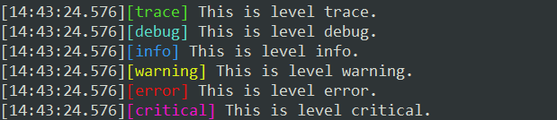
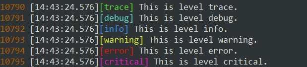
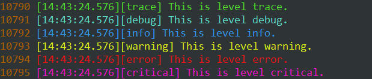

## LogView

Linux平台简单的终端日志查看工具，支持高亮日志级别关键字，或者高亮一整行。

日志内容实时更新（默认每10ms检测一次）。

### 如何使用：

```shell
./logview [options] log_file_name
```

options:

```txt
    -c --config {cfgFileName}         读取指定配置文件
    -h --help                         显示帮助页面
    -i --interval {milliseconds}      检测文件变化的间隔（默认10ms）
    -n --lines {number}               初始时显示最后多少行
    -m --mode {mode[keyword/line]}    高亮模式 （只高亮关键词 / 高亮一整行）
    -l --linenumber                   显示行号
```

默认配置文件

```ini
[basic]
detect_interval=10ms
lines_of_last=20
line_max_length=500
highlight_line=false
show_line_number=false
line_number_color=175,95,0

[trace]
text=[trace]
color=80,220,44

[debug]
text=[debug]
color=90,220,200

[info]
text=[info]
color=50,150,240

[warning]
text=[warning]
color=220,240,25

[error]
text=[error]
color=2330,20,20

[critical]
text=[critical]
color=240,20,200
```

配置项`text`就是日志级别在日志中的格式，一般左右会有括号，或者空格。（最好加上左右的分隔符）（大小写敏感）

如下面格式的日志，可以设置`text=<debug>`

```txt
 [15:55:33.380] <debug> This id level debug.
```

下面格式的日志，可以设置`text=<space>DEBUG<space>` （`<space>`表示真正的空格，如果直接用空格` `会被忽略）

```txt
 [15:55:33.380] DEBUG This is level debug.
```

### 示例：

```shell
./logview test.log
```



```shell
# 参数 -l （小写的字母L）
# 显示行号
./logview test.log -l
```



```shell
# 参数 -m mode
# 整行高亮
./logview test.log -l -m line
# 或者
./logview test.log --linenumber --mode=line
```




## END

<leopard.c@outlook.com>